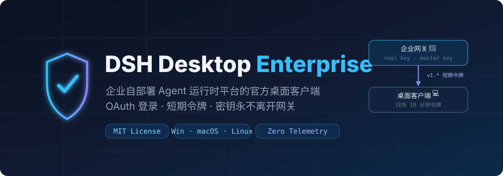
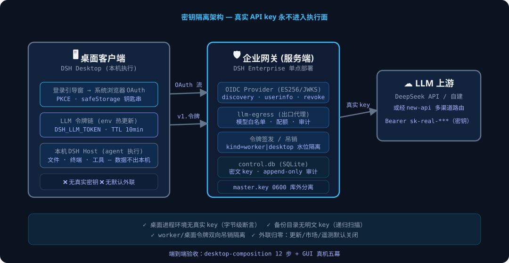
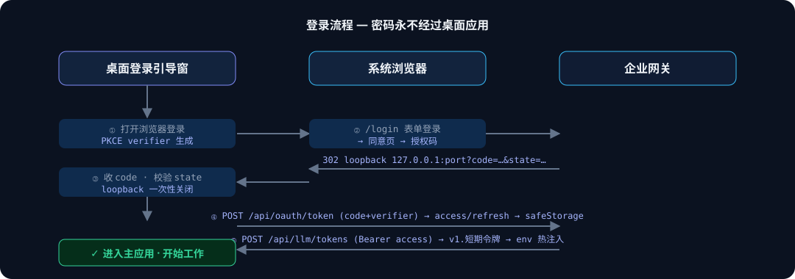
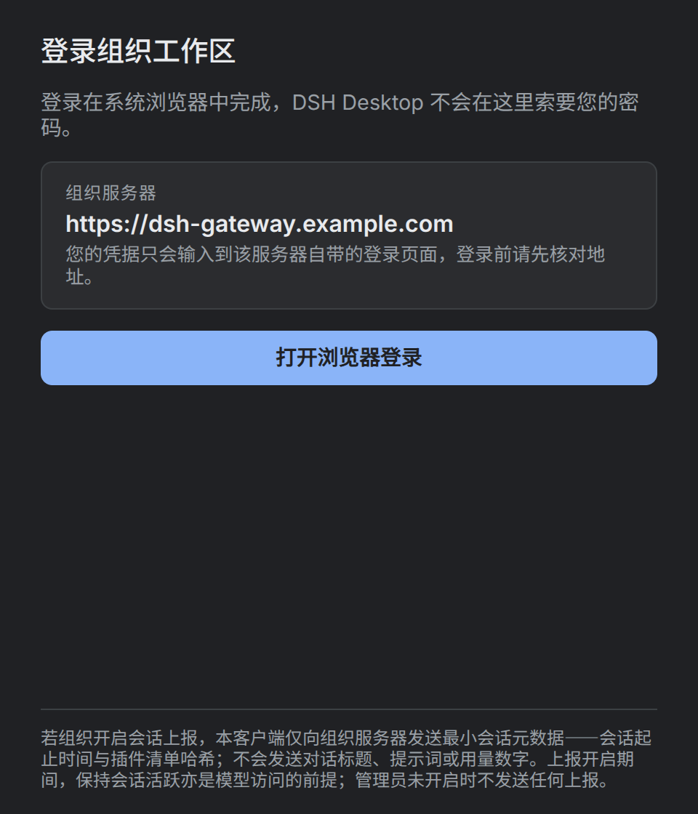

# **DSH Desktop Enterprise**

**DSH Enterprise 平台的官方桌面客户端：Agent 在本机执行，模型访问由企业网关统一治理。**

   

这是 [anywhere-labs/dsh-desktop](https://github.com/anywhere-labs/dsh-desktop) 的企业化 fork，面向使用 DSH Enterprise 内网自部署、多租户 Agent 运行时的企业开发者与平台团队。**需要配套的私有部署网关，不是独立的公共模型客户端。**

## **为什么选它**

### **密钥不下发，权限可收回**
真实大模型 API key 由企业网关保管，桌面调用模型只使用 **10 分钟短期代际令牌**。网关按令牌用途字段 `kind` 隔离权限，通过代际校验与吊销收回访问，并统一执行模型白名单、配额和审计。
**机制证据：** 模型出口令牌由网关签发，续签后热更新运行时环境；后续请求读取新令牌，无需把真实密钥写入桌面配置。

### **本机执行，集中管控模型出口**
文件操作、终端命令和工具在用户设备上执行，无需把工作目录迁移到服务端运行。模型请求经企业网关代理，平台团队集中管理模型访问。
**边界证据：** 本机执行不等于所有数据绝不出机；进入模型上下文的文件片段、提示词和工具结果会随请求发送至网关及其配置的模型服务。

### **企业登录，不接触密码**
使用 OAuth 2.0 / OpenID Connect（OIDC 身份认证协议）授权码流程，配合 PKCE（授权码交换证明密钥），在系统浏览器完成认证。
**机制证据：** 桌面不承载密码输入；OAuth 令牌通过 Electron `safeStorage` 使用系统安全存储能力加密落盘，安全存储不可用时拒绝保存，不降级为明文。

### **默认关闭外联入口**
更新检查、社区市场和遥测默认关闭；管理员可预置自建更新源，不依赖上游公共更新服务。
**机制证据：** 未配置更新源时不注册更新入口、不轮询；上游公共更新域名及其子域被直接拒绝，配置无效也不会回退上游。依赖物化、包安装及联网工具仍可能产生按需外联，完全内网部署须另行配置镜像与网络策略。

## **架构**

桌面负责本地执行，网关负责身份、租户权限与模型出口。两者之间传递短期凭证和必要请求，不分发模型供应商密钥。



真实密钥仅由网关出口用于模型服务鉴权；桌面拿到的是可过期、可吊销的代理访问凭证，而不是企业长期密钥。

## **登录流程**

预置企业网关 → 系统浏览器认证 → 本机回环回调 → 校验授权状态并交换授权码 → 加密保存 OAuth 凭证 → 获取模型出口令牌。



OAuth 会话与模型出口令牌分别续签；模型令牌通过环境热更新生效。拥有 `admin` 角色的用户可从菜单在系统浏览器打开企业管理台，实际权限由服务端校验。

## **真机界面**

登录入口展示组织预置的网关，不要求用户输入模型密钥，也不允许在登录页随意更换认证地址。



端到端验收采用 **12 步组合剧本 + 图形界面真机五幕**：登录、开启会话、吊销后重登、登出换用户、管理入口。三平台打包就绪不等同于每个平台都已完成同一轮真机验收。

## **快速开始**

准备 Git、Node.js **22.19+（22.x）或 ≥24**、Corepack，以及仓库锁定的 **Yarn 4.18.0**。先由管理员提供可访问的 DSH Enterprise 网关和已注册的桌面 OAuth 客户端标识；本机需要图形桌面与可用的系统安全存储：

```bash
git clone --recurse-submodules https://github.com/AdamPlatin123/dsh-desktop-enterprise.git
cd dsh-desktop-enterprise
corepack yarn install --immutable
export DSH_ENTERPRISE_GATEWAY_URL="https://gateway.corp.example"
export DSH_ENTERPRISE_OAUTH_CLIENT_ID="your-registered-desktop-client-id"
corepack yarn dev
```

网关地址必须是源点，不带业务路径、查询参数或内嵌凭据；示例值需替换为组织实际配置。客户端标识不是密钥，**不要在桌面配置真实模型 API key**。缺少预置时应用显示配置错误，不进入普通客户端模式。

## **打包**

构建前设置上述两个企业环境变量；需要自建更新时额外预置 `DSH_ENTERPRISE_UPDATE_URL`。在相应原生平台执行：

| 平台 | 命令 | 说明 |
| --- | --- | --- |
| Windows x64 | `corepack yarn dist:win` | 本地未签名安装包；便携版使用 `corepack yarn dist:win-portable` |
| macOS | `corepack yarn dist:mac` | 正式签名、公证构建；未签名验证使用 `corepack yarn dist:mac-smoke` |
| Linux | `corepack yarn dist:linux` | Linux 打包流程 |

签名凭据、平台限制与产物验证见[打包文档](./dsh-plugin-desktop/README.zh.md#打包)；内网更新与外联边界见[企业自托管配置](./docs/enterprise-self-hosting.md)。

## **安全模型**

| 数据 | 存放或流转位置 | 谁可访问 |
| --- | --- | --- |
| 真实模型 API key | 企业网关保管，出口请求用于模型服务鉴权 | 网关受控组件及对应模型服务鉴权端；不下发桌面 |
| 10 分钟模型代际令牌 | 桌面运行时内存，经请求交给网关 | 桌面模型调用组件与网关；受用途、有效期和吊销状态约束 |
| OAuth 访问与刷新令牌 | 本机 `safeStorage` 加密持久化，使用时解密 | 桌面认证组件与企业认证端；不是模型供应商密钥 |
| 登录密码 | 系统浏览器中的企业认证页面 | 企业身份认证服务；不经过桌面应用 |
| 工作文件与终端执行 | 用户本机 | 用户及获准执行的本地工具；纳入模型上下文的内容按下一行流转 |
| 模型请求与响应 | 桌面 ↔ 企业网关 ↔ 配置的模型服务 | 请求链路各端；留存与审计由部署策略决定 |
| 最小会话治理元数据 | 按组织策略发送至企业网关 | 企业治理服务；包括会话事件、工具分类计数、插件清单摘要，不含工具参数值 |

**Zero Telemetry 指默认关闭遥测，不是断网承诺。** 企业认证、模型请求和按策略启用的会话治理仍需通信；本地工具的网络权限也需要组织单独治理。

## **上游关系**

本 fork 在上游桌面产品基础上增加企业登录门、凭证保护、模型出口令牌与热续签、默认关闭的外联策略、自建更新源约束，以及管理员入口；**不是 Anywhere Labs 官方企业发行版**。感谢 Anywhere Labs 与 DeepSeek Harness 社区提供桌面和 Agent 运行时基础。

上游运行时保持固定版本引用，不在桌面功能分支修改其源码。升级按[上游跟随标准操作流程](./docs/fork-sop.md)执行：核对企业补丁、重跑安全回归、单独提交版本引用变更，验证失败则暂停升级。

## **License**

采用 [MIT License](./LICENSE)，保留 **Copyright © 2026 Anywhere Labs** 与 **Copyright © 2026 DSH Desktop Enterprise contributors**。允许商业使用、修改与再分发；须保留版权及许可声明。
英文版（English）见 [README.en.md](./README.en.md)。
